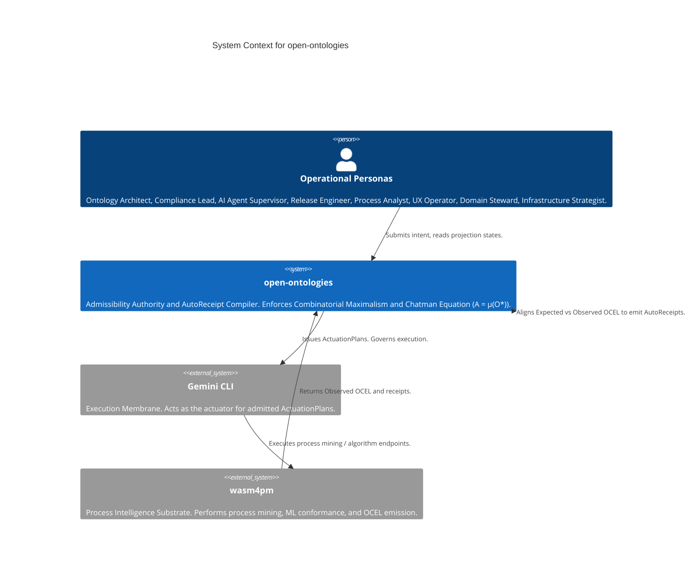
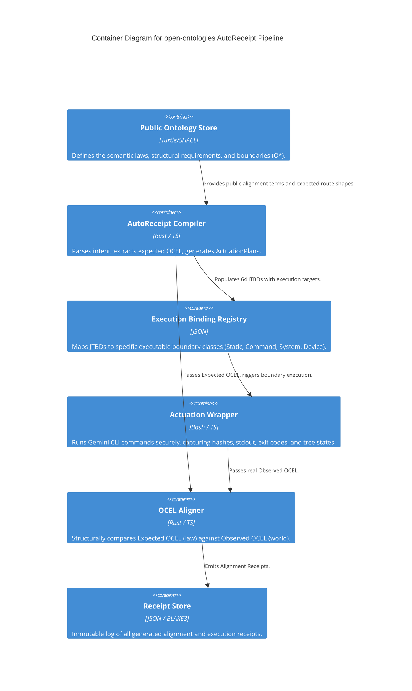
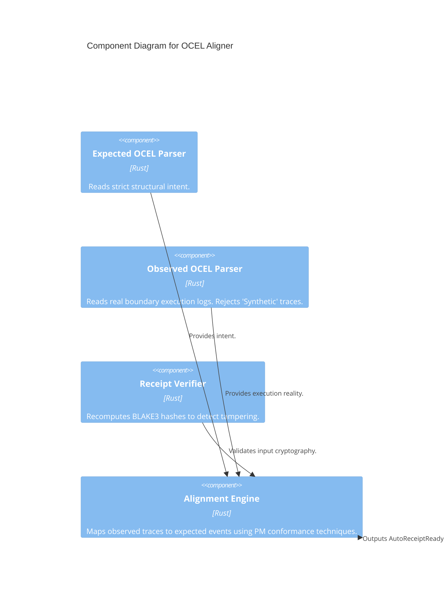

# open-ontologies C4 Architecture

## Context (Level 1)

```mermaid
C4Context
    title System Context for open-ontologies
    Person(persona, "Operational Personas", "Ontology Architect, Compliance Lead, AI Agent Supervisor, Release Engineer, Process Analyst, UX Operator, Domain Steward, Infrastructure Strategist.")
    System(oo, "open-ontologies", "Admissibility Authority and AutoReceipt Compiler. Enforces Combinatorial Maximalism and Chatman Equation (A = μ(O*)).")
    System_Ext(gemini, "Gemini CLI", "Execution Membrane. Acts as the actuator for admitted ActuationPlans.")
    System_Ext(wasm4pm, "wasm4pm", "Process Intelligence Substrate. Performs process mining, ML conformance, and OCEL emission.")
    
    Rel(persona, oo, "Submits intent, reads projection states.")
    Rel(oo, gemini, "Issues ActuationPlans. Governs execution.")
    Rel(gemini, wasm4pm, "Executes process mining / algorithm endpoints.")
    Rel(wasm4pm, oo, "Returns Observed OCEL and receipts.")
    Rel(oo, oo, "Aligns Expected vs Observed OCEL to emit AutoReceipts.")
```

## Container (Level 2)

```mermaid
C4Container
    title Container Diagram for open-ontologies AutoReceipt Pipeline
    
    Container(ontology, "Public Ontology Store", "Turtle/SHACL", "Defines the semantic laws, structural requirements, and boundaries (O*).")
    Container(ar_compiler, "AutoReceipt Compiler", "Rust / TS", "Parses intent, extracts expected OCEL, generates ActuationPlans.")
    Container(execution_binder, "Execution Binding Registry", "JSON", "Maps JTBDs to specific executable boundary classes (Static, Command, System, Device).")
    Container(gemini_wrapper, "Actuation Wrapper", "Bash / TS", "Runs Gemini CLI commands securely, capturing hashes, stdout, exit codes, and tree states.")
    Container(ocel_aligner, "OCEL Aligner", "Rust / TS", "Structurally compares Expected OCEL (law) against Observed OCEL (world).")
    Container(receipt_store, "Receipt Store", "JSON / BLAKE3", "Immutable log of all generated alignment and execution receipts.")
    
    Rel(ontology, ar_compiler, "Provides public alignment terms and expected route shapes.")
    Rel(ar_compiler, execution_binder, "Populates 64 JTBDs with execution targets.")
    Rel(execution_binder, gemini_wrapper, "Triggers boundary execution.")
    Rel(gemini_wrapper, ocel_aligner, "Passes real Observed OCEL.")
    Rel(ar_compiler, ocel_aligner, "Passes Expected OCEL.")
    Rel(ocel_aligner, receipt_store, "Emits Alignment Receipts.")
```

## Component (Level 3) - The AutoReceipt Aligner

```mermaid
C4Component
    title Component Diagram for OCEL Aligner
    
    Component(exp_parser, "Expected OCEL Parser", "Rust", "Reads strict structural intent.")
    Component(obs_parser, "Observed OCEL Parser", "Rust", "Reads real boundary execution logs. Rejects 'Synthetic' traces.")
    Component(hash_verifier, "Receipt Verifier", "Rust", "Recomputes BLAKE3 hashes to detect tampering.")
    Component(align_engine, "Alignment Engine", "Rust", "Maps observed traces to expected events using PM conformance techniques.")
    
    Rel(exp_parser, align_engine, "Provides intent.")
    Rel(obs_parser, align_engine, "Provides execution reality.")
    Rel(hash_verifier, align_engine, "Validates input cryptography.")
    Rel(align_engine, align_engine, "Outputs AutoReceiptReady or FalsePass.")
```