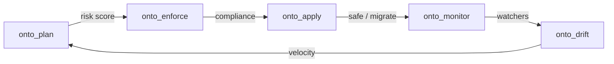

# Ontology Lifecycle

Production ontologies change over time. Open Ontologies provides Terraform-style lifecycle management.

## Plan

Diffs current vs proposed ontology. Reports added/removed classes, blast radius, risk score (`low`/`medium`/`high`). Locked IRIs (`onto_lock`) prevent accidental removal.

## Enforce

Design pattern checks. Built-in packs: `generic` (orphan classes, missing labels), `boro` (IES4/BORO compliance), `value_partition` (disjointness). Custom SPARQL rules supported.

## Apply

Two modes: `safe` (clear + reload) or `migrate` (add owl:equivalentClass/Property bridges for consumers).

## Monitor

SPARQL watchers with threshold alerts. Actions: `notify`, `block_next_apply`, `auto_rollback`, `log`.

## Drift

Compares versions, detects renames via Jaro-Winkler similarity, computes drift velocity. Self-calibrating confidence via SQLite feedback loop.

## Lineage

Append-only audit trail of all lifecycle operations.

## Feedback

Lint and enforce learn from your decisions. Dismiss a warning 3 times and it's suppressed; accept it once and it sticks. Same self-calibrating pattern used by `align` and `drift`.
