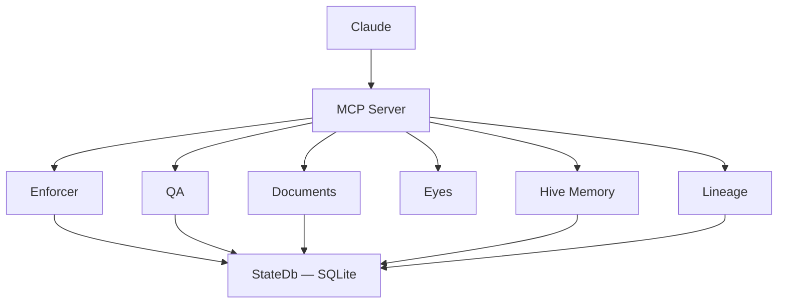
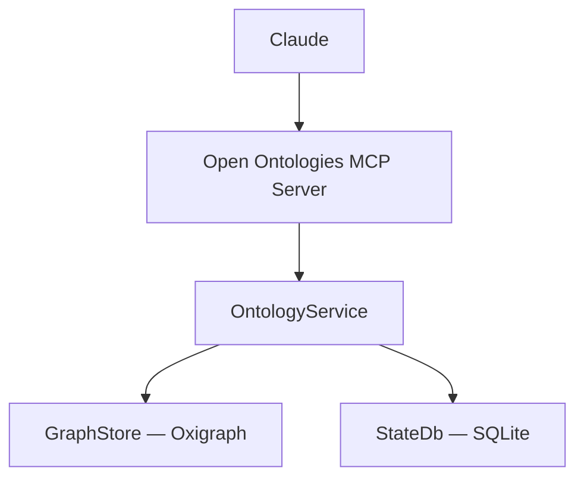

# Open Ontologies — Standalone MCP Server Design

**Date:** 2026-03-09
**Status:** Approved

## Goal

Extract all ontology code from OpenCheir into Open Ontologies, making it a standalone Rust MCP server. OpenCheir remains the governance/orchestration layer. Both servers run independently; Claude calls both.

## Architecture (After Split)

```
Claude Code
  │
  ├── MCP: open-ontologies (ontology engine)
  │     ├── onto_validate, onto_load, onto_query, ...
  │     ├── GraphStore (Oxigraph)
  │     └── StateDb (SQLite — versioning only)
  │
  └── MCP: opencheir (governance + orchestration)
        ├── qa_*, enforcer_*, lineage_*, hive_*, pattern_*
        ├── StateDb (SQLite — enforcer, lineage, memory, patterns)
        └── Supervisor (manages external MCP servers)
```

OpenCheir's enforcer rules still reference `onto_*` tool names. Claude calls `enforcer_check` from OpenCheir before ontology operations. The enforcement is advisory — same as today.

## What Moves to Open Ontologies

### Source files (copied from OpenCheir, then adapted)

| OpenCheir source | Open Ontologies target | Changes |
|-----------------|----------------------|---------|
| `src/domain/ontology.rs` (232 lines) | `src/ontology.rs` | Remove `crate::store::graph` import, use local `graph` module. Remove `StateDb` dependency — use local `state.rs`. |
| `src/store/graph.rs` (267 lines) | `src/graph.rs` | No changes needed — self-contained Oxigraph wrapper. |
| `server.rs` onto_* tools + input structs (~220 lines) | `src/server.rs` | New `OpenOntologiesServer` struct. Only 15 onto_* tools. Own `graph` and `db` fields. |
| `src/store/state.rs` (partial) | `src/state.rs` | Minimal: just `ontology_versions` table creation + connection management. No enforcer, lineage, memory, patterns tables. |

### Test files (copied from OpenCheir)

| OpenCheir test | Open Ontologies target |
|---------------|----------------------|
| `tests/ontology_test.rs` | `tests/ontology_test.rs` |
| `tests/graph_test.rs` | `tests/graph_test.rs` |
| `tests/graph_remote_test.rs` | `tests/graph_remote_test.rs` |
| `tests/onto_phase2_test.rs` | `tests/onto_phase2_test.rs` |
| `tests/onto_integration_test.rs` | `tests/onto_integration_test.rs` |

### Dependencies (Cargo.toml)

```toml
[package]
name = "open-ontologies"
version = "0.1.0"
edition = "2024"
description = "AI-native ontology engine — standalone MCP server"
license = "MIT"
repository = "https://github.com/fabio-rovai/open-ontologies"

[[bin]]
name = "open-ontologies"
path = "src/main.rs"

[dependencies]
rmcp = { version = "1", features = ["server", "transport-io"] }
tokio = { version = "1", features = ["full"] }
oxigraph = "0.4"
rusqlite = { version = "0.32", features = ["bundled"] }
reqwest = { version = "0.12", features = ["json"] }
schemars = "1"
serde = { version = "1", features = ["derive"] }
serde_json = "1"
toml = "0.8"
clap = { version = "4", features = ["derive"] }
tracing = "0.1"
tracing-subscriber = { version = "0.3", features = ["env-filter"] }
uuid = { version = "1", features = ["v4"] }
chrono = "0.4"
anyhow = "1"

[dev-dependencies]
tempfile = "3"
```

## Open Ontologies Project Structure

```
open-ontologies/
├── src/
│   ├── main.rs          # CLI: init + serve
│   ├── lib.rs           # pub mod graph, ontology, server, state, config
│   ├── server.rs        # OpenOntologiesServer with 15 onto_* tools
│   ├── graph.rs         # GraphStore (Oxigraph wrapper)
│   ├── ontology.rs      # OntologyService (validate, diff, lint, versioning)
│   ├── state.rs         # Minimal SQLite (ontology_versions table only)
│   └── config.rs        # Simple config: data_dir only
├── tests/
│   ├── ontology_test.rs
│   ├── graph_test.rs
│   ├── graph_remote_test.rs
│   ├── onto_phase2_test.rs
│   └── onto_integration_test.rs
├── benchmark/           # Existing — unchanged
├── skills/              # Existing — unchanged
├── docs/                # Existing + this design doc
├── Cargo.toml           # New
├── Cargo.lock           # New (generated)
├── CLAUDE.md            # Update: remove OpenCheir references, describe standalone
├── README.md            # Update: standalone server, new architecture diagram
└── LICENSE              # Existing — unchanged
```

## What Gets Removed from OpenCheir

### Files deleted
- `src/domain/ontology.rs`
- `src/store/graph.rs`
- `tests/ontology_test.rs`
- `tests/graph_test.rs`
- `tests/graph_remote_test.rs`
- `tests/onto_phase2_test.rs`
- `tests/onto_integration_test.rs`

### Code removed from `src/gateway/server.rs`
- All `Onto*Input` structs (OntoValidateInput, OntoConvertInput, OntoLoadInput, etc.)
- All `onto_*` tool functions
- The `graph: Arc<GraphStore>` field from `OpenCheirServer`
- The `GraphStore` import

### Dependencies removed from `Cargo.toml`
- `oxigraph` — only used by ontology
- `reqwest` — check if used elsewhere (supervisor health checks?). If only ontology uses it, remove.

### Code updated
- `OpenCheirServer::new()` — remove `graph` field initialization
- `opencheir_health` — remove ontology from component list
- `src/domain/mod.rs` — remove `pub mod ontology`
- `src/store/mod.rs` — remove `pub mod graph`

### README.md — updated
- Remove Ontology row from features table
- Remove all onto_* tools from tools section
- Update mermaid diagram to remove Ontology and GraphStore nodes
- Add note pointing to Open Ontologies for ontology features
- Update tool count

### Enforcer rules — unchanged
- `onto_validate_after_save` and `onto_version_before_push` stay in OpenCheir
- They still work: Claude calls `enforcer_check("onto_save")` from OpenCheir, then calls `onto_save` from Open Ontologies

## Updated README: OpenCheir

### Mermaid diagram (replaces current)



### Features table (replaces current)

| Module | Tools | Purpose |
|--------|-------|---------|
| Document QA | 5 | Font, dash, word count, signature checks |
| Document Parsing | 2 | DOCX structure extraction |
| Search | 1 | FTS5 full-text search |
| Enforcer | 4 | Workflow rule engine with hot-reload |
| Lineage | 3 | Audit trail & event tracking |
| Patterns | 2 | Cross-session pattern discovery |
| Memory | 3 | Persistent learning storage |
| Hive | 2 | Domain locking for multi-agent |
| Status | 2 | Health monitoring |

Add a note: "For ontology engineering (RDF/OWL/SPARQL), see [Open Ontologies](https://github.com/fabio-rovai/open-ontologies)."

## Updated README: Open Ontologies

### Key changes

1. **"What is it?" section** — rewrite to describe standalone server, not a module of OpenCheir
2. **Architecture diagram** — new mermaid showing standalone server
3. **"Replicate it yourself" section** — updated install instructions (build open-ontologies directly)
4. **Stack section** — updated to reflect standalone binary
5. **Enforcer section** — note that enforcer rules live in OpenCheir (optional companion)

### New architecture diagram



### New "What is it?" section

```markdown
Open Ontologies is a standalone MCP server for AI-native ontology engineering.
It exposes 15 tools that let Claude validate, query, diff, lint, version, and
persist RDF/OWL ontologies using an in-memory Oxigraph triple store.

Written in Rust, ships as a single binary. No JVM, no Protege, no GUI.

**Optional companion:** [OpenCheir](https://github.com/fabio-rovai/opencheir)
adds workflow enforcement, audit trails, and multi-agent orchestration.
Its enforcer rules can govern ontology workflows (e.g., warn if saving
without validating). But Open Ontologies works perfectly on its own.
```

### New "Replicate it yourself" section

```markdown
### 1. Build Open Ontologies

git clone https://github.com/fabio-rovai/open-ontologies.git
cd open-ontologies
cargo build --release

### 2. Connect to Claude Code

Add to ~/.claude/settings.json:

{
  "mcpServers": {
    "open-ontologies": {
      "command": "/path/to/open-ontologies/target/release/open-ontologies",
      "args": ["serve"]
    }
  }
}

### 3. (Optional) Add OpenCheir for governance

{
  "mcpServers": {
    "open-ontologies": { ... },
    "opencheir": {
      "command": "/path/to/opencheir/target/release/opencheir",
      "args": ["serve"]
    }
  }
}
```

## Updated CLAUDE.md: Open Ontologies

### Changes
- Remove "OpenCheir enforces workflow safety rules" section
- Replace with optional note: "If OpenCheir is also connected, its enforcer rules provide workflow safety"
- Tool names stay the same (onto_*) — they're now native to this server

## Updated CLAUDE.md: OpenCheir

### Changes
- No changes needed. The enforcer rules still reference onto_* tool names.
- Claude calls enforcer_check from OpenCheir, then calls the actual tool from Open Ontologies.

## State Management

Open Ontologies gets its own SQLite database at `~/.open-ontologies/state.db`.

### Schema (single table)

```sql
CREATE TABLE IF NOT EXISTS ontology_versions (
    id INTEGER PRIMARY KEY AUTOINCREMENT,
    label TEXT NOT NULL,
    triple_count INTEGER NOT NULL,
    content TEXT NOT NULL,
    format TEXT NOT NULL DEFAULT 'ntriples',
    created_at TEXT NOT NULL DEFAULT (datetime('now'))
);
```

### Config file

`~/.open-ontologies/config.toml`:

```toml
[general]
data_dir = "~/.open-ontologies"
```

### CLI

```
open-ontologies init    # Create data dir, config, DB
open-ontologies serve   # Start MCP server on stdio
```

## Migration Checklist

### Open Ontologies (new code)
1. Create `Cargo.toml`
2. Create `src/main.rs` — CLI with init + serve
3. Create `src/lib.rs` — module exports
4. Create `src/config.rs` — minimal config
5. Create `src/state.rs` — minimal SQLite (ontology_versions only)
6. Copy + adapt `src/graph.rs` from OpenCheir
7. Copy + adapt `src/ontology.rs` from OpenCheir
8. Create `src/server.rs` — OpenOntologiesServer with 15 tools
9. Copy + adapt tests
10. Update `README.md` — standalone server, new diagrams
11. Update `CLAUDE.md` — remove OpenCheir dependency language
12. Build and verify: `cargo build && cargo test`

### OpenCheir (removals)
13. Delete `src/domain/ontology.rs`
14. Delete `src/store/graph.rs`
15. Delete ontology tests
16. Remove onto_* code from `src/gateway/server.rs`
17. Update module declarations (lib.rs, domain/mod.rs, store/mod.rs)
18. Remove `oxigraph` (and possibly `reqwest`) from Cargo.toml
19. Update `README.md` — remove ontology, update diagrams
20. Build and verify: `cargo build && cargo test`
