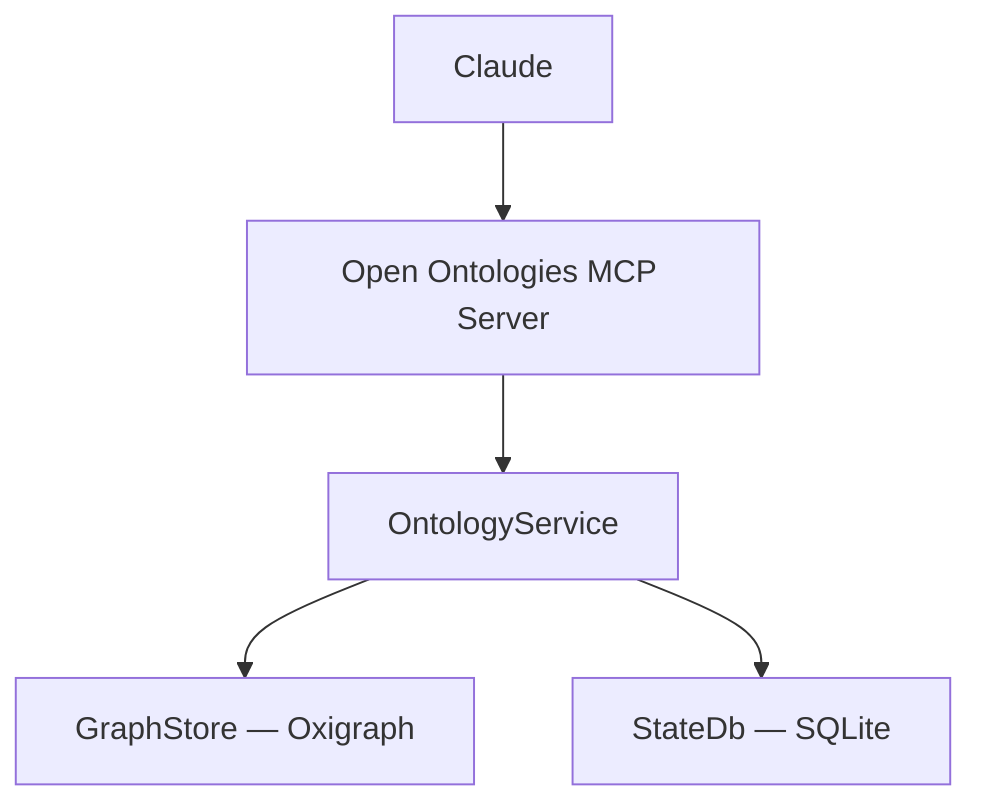
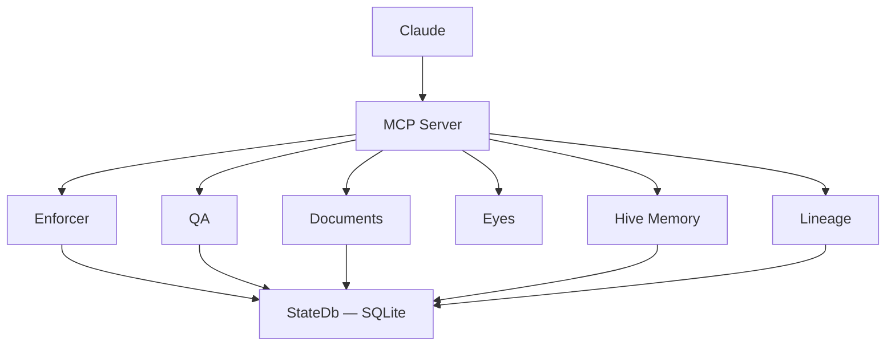

# Open Ontologies Standalone MCP Server — Implementation Plan

> **For Claude:** REQUIRED SUB-SKILL: Use superpowers:executing-plans to implement this plan task-by-task.

**Goal:** Extract all ontology code from OpenCheir into Open Ontologies as a standalone Rust MCP server, then remove it from OpenCheir.

**Architecture:** Two independent MCP servers. Open Ontologies owns the Oxigraph graph store and all 15 `onto_*` tools. OpenCheir keeps governance (enforcer, lineage, hive, QA). Claude calls both directly.

**Tech Stack:** Rust 2024, rmcp 1.x, Oxigraph 0.4, SQLite (rusqlite), tokio, reqwest, clap

**Design doc:** `docs/plans/2026-03-09-standalone-mcp-server-design.md`

**Repos:**
- Open Ontologies: `/Users/fabio/projects/open-ontologies`
- OpenCheir: `/Users/fabio/projects/opencheir`

---

## Phase 1: Build Open Ontologies MCP Server

### Task 1: Create Cargo.toml

**Files:**
- Create: `Cargo.toml`

**Step 1: Create the Cargo.toml**

```toml
[package]
name = "open-ontologies"
version = "0.1.0"
edition = "2024"
description = "AI-native ontology engine — standalone MCP server"
license = "MIT"
repository = "https://github.com/fabio-rovai/open-ontologies"

[[bin]]
name = "open-ontologies"
path = "src/main.rs"

[dependencies]
rmcp = { version = "1", features = ["server", "transport-io"] }
tokio = { version = "1", features = ["full"] }
oxigraph = "0.4"
rusqlite = { version = "0.32", features = ["bundled"] }
reqwest = { version = "0.12", features = ["json"] }
schemars = "1"
serde = { version = "1", features = ["derive"] }
serde_json = "1"
toml = "0.8"
clap = { version = "4", features = ["derive"] }
tracing = "0.1"
tracing-subscriber = { version = "0.3", features = ["env-filter"] }
chrono = "0.4"
anyhow = "1"

[dev-dependencies]
tempfile = "3"
```

**Step 2: Verify it parses**

Run: `cd /Users/fabio/projects/open-ontologies && cargo check 2>&1 | head -5`
Expected: Errors about missing `src/main.rs` (that's fine — we'll create it next)

**Step 3: Commit**

```bash
git add Cargo.toml
git commit -m "feat: add Cargo.toml for standalone MCP server"
```

---

### Task 2: Create graph.rs (Oxigraph wrapper)

**Files:**
- Create: `src/graph.rs`

Copy from `/Users/fabio/projects/opencheir/src/store/graph.rs` verbatim. No changes needed — it's self-contained.

**Step 1: Create `src/` directory and copy graph.rs**

Create `src/graph.rs` with the exact content of `/Users/fabio/projects/opencheir/src/store/graph.rs` (267 lines). No modifications needed.

**Step 2: Create stub lib.rs so it compiles**

Create `src/lib.rs`:
```rust
pub mod graph;
```

Create `src/main.rs`:
```rust
fn main() {
    println!("open-ontologies");
}
```

**Step 3: Verify it compiles**

Run: `cargo check`
Expected: Success (warnings about unused code are fine)

**Step 4: Commit**

```bash
git add src/graph.rs src/lib.rs src/main.rs
git commit -m "feat: add GraphStore — Oxigraph RDF/SPARQL wrapper"
```

---

### Task 3: Create state.rs (minimal SQLite for versioning)

**Files:**
- Create: `src/state.rs`

This is a minimal version of OpenCheir's `StateDb` — only the `ontology_versions` table.

**Step 1: Create state.rs**

```rust
use anyhow::Result;
use rusqlite::Connection;
use std::path::Path;
use std::sync::{Arc, Mutex};

const SCHEMA: &str = "
CREATE TABLE IF NOT EXISTS ontology_versions (
    id INTEGER PRIMARY KEY AUTOINCREMENT,
    label TEXT NOT NULL,
    triple_count INTEGER NOT NULL,
    content TEXT NOT NULL,
    format TEXT NOT NULL DEFAULT 'ntriples',
    created_at TEXT NOT NULL DEFAULT (datetime('now'))
);
";

/// Minimal SQLite state store for ontology versioning.
#[derive(Clone)]
pub struct StateDb {
    conn: Arc<Mutex<Connection>>,
}

impl StateDb {
    pub fn open(path: &Path) -> Result<Self> {
        let conn = Connection::open(path)?;
        conn.pragma_update(None, "journal_mode", "WAL")?;
        conn.pragma_update(None, "foreign_keys", "ON")?;
        conn.pragma_update(None, "synchronous", "NORMAL")?;
        conn.execute_batch(SCHEMA)?;
        Ok(Self {
            conn: Arc::new(Mutex::new(conn)),
        })
    }

    pub fn conn(&self) -> std::sync::MutexGuard<'_, Connection> {
        self.conn.lock().unwrap()
    }
}
```

**Step 2: Add module to lib.rs**

Update `src/lib.rs`:
```rust
pub mod graph;
pub mod state;
```

**Step 3: Verify it compiles**

Run: `cargo check`
Expected: Success

**Step 4: Commit**

```bash
git add src/state.rs src/lib.rs
git commit -m "feat: add minimal StateDb for ontology versioning"
```

---

### Task 4: Create ontology.rs (service layer)

**Files:**
- Create: `src/ontology.rs`

Copy from `/Users/fabio/projects/opencheir/src/domain/ontology.rs` and update imports to use local modules instead of `crate::store::graph` and `crate::store::state`.

**Step 1: Create ontology.rs**

Copy the content of `/Users/fabio/projects/opencheir/src/domain/ontology.rs` (232 lines) and change two imports:

- `use crate::store::graph::GraphStore;` → `use crate::graph::GraphStore;`
- `use crate::store::state::StateDb;` → `use crate::state::StateDb;`

Everything else stays identical.

**Step 2: Add module to lib.rs**

Update `src/lib.rs`:
```rust
pub mod graph;
pub mod ontology;
pub mod state;
```

**Step 3: Verify it compiles**

Run: `cargo check`
Expected: Success

**Step 4: Commit**

```bash
git add src/ontology.rs src/lib.rs
git commit -m "feat: add OntologyService — validate, diff, lint, versioning"
```

---

### Task 5: Create config.rs

**Files:**
- Create: `src/config.rs`

**Step 1: Create config.rs**

```rust
use anyhow::{Context, Result};
use serde::Deserialize;
use std::path::Path;

#[derive(Debug, Deserialize)]
#[serde(default)]
pub struct Config {
    pub general: GeneralConfig,
}

impl Default for Config {
    fn default() -> Self {
        Self {
            general: GeneralConfig::default(),
        }
    }
}

impl Config {
    pub fn load(path: &Path) -> Result<Self> {
        let contents = std::fs::read_to_string(path)
            .with_context(|| format!("failed to read config file: {}", path.display()))?;
        let config: Config = toml::from_str(&contents)
            .with_context(|| format!("failed to parse config file: {}", path.display()))?;
        Ok(config)
    }
}

#[derive(Debug, Deserialize)]
#[serde(default)]
pub struct GeneralConfig {
    pub data_dir: String,
}

impl Default for GeneralConfig {
    fn default() -> Self {
        Self {
            data_dir: "~/.open-ontologies".into(),
        }
    }
}

/// Expand a leading `~` in a path to the user's home directory.
pub fn expand_tilde(path: &str) -> String {
    if path.starts_with("~/") || path == "~" {
        if let Some(home) = std::env::var_os("HOME") {
            return path.replacen("~", &home.to_string_lossy(), 1);
        }
    }
    path.to_string()
}
```

**Step 2: Add module to lib.rs**

Update `src/lib.rs`:
```rust
pub mod config;
pub mod graph;
pub mod ontology;
pub mod state;
```

**Step 3: Verify it compiles**

Run: `cargo check`
Expected: Success

**Step 4: Commit**

```bash
git add src/config.rs src/lib.rs
git commit -m "feat: add minimal config for data directory"
```

---

### Task 6: Create server.rs (MCP server with 15 onto_* tools)

**Files:**
- Create: `src/server.rs`

This is the MCP server. Copy the 15 `onto_*` tool definitions and their input structs from `/Users/fabio/projects/opencheir/src/gateway/server.rs` lines 146-234 (input structs) and lines 571-792 (tool implementations). Change the server struct name to `OpenOntologiesServer`.

**Step 1: Create server.rs**

The server struct:

```rust
use std::sync::Arc;

use rmcp::{
    ServerHandler, tool, tool_handler, tool_router,
    handler::server::{tool::ToolRouter, wrapper::Parameters},
    model::{ServerCapabilities, ServerInfo, Tool},
};
use schemars::JsonSchema;
use serde::Deserialize;

use crate::graph::GraphStore;
use crate::state::StateDb;
```

Then copy all `Onto*Input` structs from OpenCheir's `server.rs` (lines 146-234):
- `OntoValidateInput`
- `OntoConvertInput`
- `OntoLoadInput`
- `OntoQueryInput`
- `OntoSaveInput`
- `OntoDiffInput`
- `OntoLintInput`
- `OntoPullInput`
- `OntoPushInput`
- `OntoImportInput`
- `OntoVersionInput`
- `OntoRollbackInput`

Server struct:

```rust
#[derive(Clone)]
pub struct OpenOntologiesServer {
    tool_router: ToolRouter<Self>,
    db: StateDb,
    graph: Arc<GraphStore>,
}

impl OpenOntologiesServer {
    pub fn new(db: StateDb) -> Self {
        Self {
            tool_router: Self::tool_router(),
            db,
            graph: Arc::new(GraphStore::new()),
        }
    }

    pub fn list_tool_definitions(&self) -> Vec<Tool> {
        self.tool_router.list_all()
    }
}
```

Then the `#[tool_router] impl` block with all 15 tools + a status tool. Copy each tool from OpenCheir's server.rs lines 571-792, changing:
- `use crate::domain::ontology::OntologyService;` → `use crate::ontology::OntologyService;`
- `use crate::store::graph::GraphStore;` → `use crate::graph::GraphStore;`

Add a status tool:

```rust
#[tool(name = "onto_status", description = "Returns health status of the Open Ontologies server")]
fn onto_status(&self) -> String {
    let tool_count = self.tool_router.list_all().len();
    let triple_count = self.graph.triple_count();
    serde_json::json!({
        "status": "ok",
        "version": env!("CARGO_PKG_VERSION"),
        "tools": tool_count,
        "triples_loaded": triple_count,
    })
    .to_string()
}
```

Then the `ServerHandler` impl:

```rust
#[tool_handler]
impl ServerHandler for OpenOntologiesServer {
    fn get_info(&self) -> ServerInfo {
        ServerInfo::new(ServerCapabilities::builder().enable_tools().build())
            .with_instructions("Open Ontologies: AI-native ontology engine — RDF/OWL/SPARQL MCP server")
    }
}
```

**Step 2: Add module to lib.rs**

Update `src/lib.rs`:
```rust
pub mod config;
pub mod graph;
pub mod ontology;
pub mod server;
pub mod state;
```

**Step 3: Verify it compiles**

Run: `cargo check`
Expected: Success

**Step 4: Commit**

```bash
git add src/server.rs src/lib.rs
git commit -m "feat: add OpenOntologiesServer with 15 onto_* MCP tools"
```

---

### Task 7: Create main.rs (CLI with init + serve)

**Files:**
- Modify: `src/main.rs`

**Step 1: Write main.rs**

```rust
use clap::{Parser, Subcommand};
use rmcp::ServiceExt;

use open_ontologies::config::{expand_tilde, Config};
use open_ontologies::server::OpenOntologiesServer;
use open_ontologies::state::StateDb;

const DEFAULT_CONFIG: &str = r#"[general]
data_dir = "~/.open-ontologies"
"#;

#[derive(Parser)]
#[command(name = "open-ontologies", about = "AI-native ontology engine — MCP server")]
struct Cli {
    #[command(subcommand)]
    command: Commands,
}

#[derive(Subcommand)]
enum Commands {
    /// Initialize: create data directory, DB, and default config
    Init {
        #[arg(long, default_value = "~/.open-ontologies")]
        data_dir: String,
    },
    /// Start the MCP server
    Serve {
        #[arg(long, default_value = "~/.open-ontologies/config.toml")]
        config: String,
    },
}

#[tokio::main]
async fn main() -> anyhow::Result<()> {
    let cli = Cli::parse();

    match cli.command {
        Commands::Init { data_dir } => {
            let data_dir = expand_tilde(&data_dir);
            let data_path = std::path::Path::new(&data_dir);

            std::fs::create_dir_all(data_path)?;
            println!("Created data directory: {data_dir}");

            let db_path = data_path.join("open-ontologies.db");
            let _db = StateDb::open(&db_path)?;
            println!("Initialized database: {}", db_path.display());

            let config_path = data_path.join("config.toml");
            if !config_path.exists() {
                std::fs::write(&config_path, DEFAULT_CONFIG)?;
                println!("Created default config: {}", config_path.display());
            } else {
                println!("Config already exists: {}", config_path.display());
            }

            println!("\nOpen Ontologies initialized successfully!");
        }
        Commands::Serve { config: config_path } => {
            let config_path = expand_tilde(&config_path);
            let cfg = match Config::load(std::path::Path::new(&config_path)) {
                Ok(c) => c,
                Err(e) => {
                    let msg = e.to_string();
                    if msg.contains("failed to read") {
                        Config::default()
                    } else {
                        return Err(e);
                    }
                }
            };
            let data_dir = expand_tilde(&cfg.general.data_dir);
            let db_path = std::path::Path::new(&data_dir).join("open-ontologies.db");

            std::fs::create_dir_all(&data_dir)?;
            let db = StateDb::open(&db_path)?;

            let server = OpenOntologiesServer::new(db);
            let service = server.serve(rmcp::transport::stdio()).await?;
            service.waiting().await?;
        }
    }

    Ok(())
}
```

**Step 2: Build the binary**

Run: `cargo build`
Expected: Compiles successfully

**Step 3: Test init command**

Run: `./target/debug/open-ontologies init --data-dir /tmp/test-onto`
Expected: Creates directory, DB, and config. Output shows three "Created" lines.

Run: `ls /tmp/test-onto/`
Expected: `config.toml  open-ontologies.db`

Clean up: `rm -rf /tmp/test-onto`

**Step 4: Commit**

```bash
git add src/main.rs
git commit -m "feat: add CLI with init and serve commands"
```

---

### Task 8: Copy tests and test data

**Files:**
- Create: `tests/graph_test.rs`
- Create: `tests/ontology_test.rs`
- Create: `tests/ontology_version_test.rs`
- Create: `tests/onto_phase2_test.rs`
- Create: `tests/onto_integration_test.rs`
- Create: `tests/graph_remote_test.rs`
- Create: `tests/data/sample.ttl`

**Step 1: Copy test data**

Copy `/Users/fabio/projects/opencheir/tests/data/sample.ttl` to `tests/data/sample.ttl`.

**Step 2: Copy and adapt test files**

Copy each test file from OpenCheir. In every file, change imports:
- `use opencheir::domain::ontology::OntologyService;` → `use open_ontologies::ontology::OntologyService;`
- `use opencheir::store::graph::GraphStore;` → `use open_ontologies::graph::GraphStore;`
- `use opencheir::store::state::StateDb;` → `use open_ontologies::state::StateDb;`

Remove any test that references OpenCheir-specific code (e.g., the enforcer test in `onto_phase2_test.rs` — `test_version_before_push_enforcer` — must be removed since the enforcer doesn't exist in this crate).

Files to copy and adapt:
- `graph_test.rs` — change `opencheir::store::graph` → `open_ontologies::graph`
- `ontology_test.rs` — change `opencheir::domain::ontology` → `open_ontologies::ontology`
- `ontology_version_test.rs` — change both imports
- `graph_remote_test.rs` — change import
- `onto_integration_test.rs` — change both imports
- `onto_phase2_test.rs` — change imports, remove `test_version_before_push_enforcer` test (it uses `Enforcer` which stays in OpenCheir)

**Step 3: Run all tests**

Run: `cargo test`
Expected: All tests pass

**Step 4: Commit**

```bash
git add tests/
git commit -m "feat: add tests for graph store, ontology service, and versioning"
```

---

### Task 9: Full build and release test

**Files:** None (verification only)

**Step 1: Clean build**

Run: `cargo build --release`
Expected: Compiles with no errors

**Step 2: Run all tests**

Run: `cargo test`
Expected: All tests pass

**Step 3: Test binary**

Run: `./target/release/open-ontologies init --data-dir /tmp/test-onto && ls /tmp/test-onto/`
Expected: `config.toml  open-ontologies.db`

Clean up: `rm -rf /tmp/test-onto`

**Step 4: Commit (if any fixes were needed)**

---

## Phase 2: Update Open Ontologies Documentation

### Task 10: Update README.md

**Files:**
- Modify: `README.md`

**Step 1: Rewrite the "What is it?" section**

Replace the current two-project description (lines 26-28) with:

```markdown
Open Ontologies is a standalone MCP server for AI-native ontology engineering. It exposes 15 tools that let Claude validate, query, diff, lint, version, and persist RDF/OWL ontologies using an in-memory Oxigraph triple store.

Written in Rust, ships as a single binary. No JVM, no Protege, no GUI.

**Optional companion:** [OpenCheir](https://github.com/fabio-rovai/opencheir) adds workflow enforcement, audit trails, and multi-agent orchestration. Its enforcer rules can govern ontology workflows (e.g., warn if saving without validating). But Open Ontologies works perfectly on its own.
```

**Step 2: Update the "How it works" section mermaid and text**

Change the line about "37 total" tools to "15 ontology tools". Remove references to OpenCheir being required.

Replace:
> This is not a fixed pipeline inside the MCP server. The MCP server exposes 15 ontology tools (37 total) — **Claude is the orchestrator**...

With:
> This is not a fixed pipeline. The MCP server exposes 15 ontology tools — **Claude is the orchestrator**...

Replace:
> No Protege. No GUI. No manual class creation. Claude is the ontology engineer, OpenCheir is the runtime.

With:
> No Protege. No GUI. No manual class creation. Claude is the ontology engineer, Open Ontologies is the runtime.

**Step 3: Add architecture diagram**

After the workflow mermaid, add:

```markdown
### Architecture


```

**Step 4: Rewrite "Replicate it yourself" section**

Replace the current clone-both-repos instructions with:

```markdown
## Replicate it yourself

### 1. Build Open Ontologies

You need Rust 1.85+ (edition 2024).

```bash
git clone https://github.com/fabio-rovai/open-ontologies.git
cd open-ontologies
cargo build --release
./target/release/open-ontologies init
```

### 2. Connect to Claude Code

Add to `~/.claude/settings.json`:

```json
{
  "mcpServers": {
    "open-ontologies": {
      "command": "/path/to/open-ontologies/target/release/open-ontologies",
      "args": ["serve"]
    }
  }
}
```

Restart Claude Code. You should see the `onto_*` tools available.

### 3. (Optional) Add OpenCheir for governance

For workflow enforcement, audit trails, and multi-agent orchestration:

```json
{
  "mcpServers": {
    "open-ontologies": {
      "command": "/path/to/open-ontologies/target/release/open-ontologies",
      "args": ["serve"]
    },
    "opencheir": {
      "command": "/path/to/opencheir/target/release/opencheir",
      "args": ["serve"]
    }
  }
}
```
```

**Step 5: Update "Stack" section**

Replace:
```markdown
## Stack

- **Rust** (edition 2024) — single binary, no JVM
- **Oxigraph** — pure Rust RDF/SPARQL engine
- **OpenCheir** — MCP server framework with enforcer (hot-reload), domain locking, lineage, memory, QA
```

With:
```markdown
## Stack

- **Rust** (edition 2024) — single binary, no JVM
- **Oxigraph 0.4** — pure Rust RDF/SPARQL engine
- **rmcp** — MCP protocol implementation
- **SQLite** — ontology version storage
```

**Step 6: Add Tools section with `onto_status`**

Add `onto_status` to the tools table:

```markdown
| `onto_status` | Server health and loaded triple count |
```

**Step 7: Commit**

```bash
git add README.md
git commit -m "docs: update README for standalone MCP server"
```

---

### Task 11: Update CLAUDE.md

**Files:**
- Modify: `CLAUDE.md`

**Step 1: Update enforcer section**

Replace the "Enforcer Rules" section:

```markdown
## Enforcer Rules (Optional)

If [OpenCheir](https://github.com/fabio-rovai/opencheir) is also connected as an MCP server, its enforcer rules provide workflow safety:

- **onto_validate_after_save** — warns if you save 3+ times without validating
- **onto_version_before_push** — warns if you push without saving a version snapshot first

These rules are optional — Open Ontologies works perfectly without OpenCheir.
```

**Step 2: Commit**

```bash
git add CLAUDE.md
git commit -m "docs: update CLAUDE.md for standalone operation"
```

---

## Phase 3: Remove Ontology from OpenCheir

All changes in this phase happen in `/Users/fabio/projects/opencheir`.

### Task 12: Remove ontology source files

**Files:**
- Delete: `src/domain/ontology.rs`
- Delete: `src/store/graph.rs`
- Modify: `src/domain/mod.rs` — remove `pub mod ontology;`
- Modify: `src/store/mod.rs` — remove `pub mod graph;`

**Step 1: Delete files**

```bash
cd /Users/fabio/projects/opencheir
rm src/domain/ontology.rs
rm src/store/graph.rs
```

**Step 2: Update module declarations**

`src/domain/mod.rs` — change to:
```rust
pub mod eyes;
pub mod qa;
```

`src/store/mod.rs` — change to:
```rust
pub mod state;
pub mod documents;
pub mod search;
```

**Step 3: Verify compiler errors point only to server.rs**

Run: `cargo check 2>&1 | head -30`
Expected: Errors only in `server.rs` about missing ontology/graph imports and onto_* methods. No errors in other files.

**Step 4: Commit**

```bash
git add -A
git commit -m "refactor: remove ontology module and graph store"
```

---

### Task 13: Remove onto_* tools from server.rs

**Files:**
- Modify: `src/gateway/server.rs`

**Step 1: Remove ontology input structs**

Delete the following structs (lines 146-234 approximately):
- `OntoValidateInput`
- `OntoConvertInput`
- `OntoLoadInput`
- `OntoQueryInput`
- `OntoSaveInput`
- `OntoDiffInput`
- `OntoLintInput`
- `OntoPullInput`
- `OntoPushInput`
- `OntoImportInput`
- `OntoVersionInput`
- `OntoRollbackInput`

**Step 2: Remove the `graph` field from `OpenCheirServer`**

Remove `graph: Arc<GraphStore>,` from the struct definition.

Remove `use crate::store::graph::GraphStore;` from imports.

Update `OpenCheirServer::new()` — remove `graph: Arc::new(GraphStore::new()),`.

**Step 3: Remove all onto_* tool functions**

Delete the entire `// ── Ontology ──` section (lines ~571-792), covering:
- `onto_validate`
- `onto_convert`
- `onto_load`
- `onto_query`
- `onto_save`
- `onto_stats`
- `onto_diff`
- `onto_lint`
- `onto_clear`
- `onto_pull`
- `onto_push`
- `onto_import`
- `onto_version`
- `onto_history`
- `onto_rollback`

**Step 4: Update health tool**

In `opencheir_health`, remove the ontology line. The components JSON should no longer list ontology.

**Step 5: Verify it compiles**

Run: `cargo check`
Expected: Success (warnings about unused imports are fine for now)

**Step 6: Commit**

```bash
git add src/gateway/server.rs
git commit -m "refactor: remove all onto_* tools from OpenCheir server"
```

---

### Task 14: Remove ontology dependencies from Cargo.toml

**Files:**
- Modify: `Cargo.toml`

**Step 1: Remove oxigraph and reqwest**

Remove these lines:
```toml
# RDF / SPARQL / OWL engine (ontology module)
oxigraph = "0.4"
```

```toml
# HTTP client (health checks)
reqwest = { version = "0.12", features = ["json"] }
```

**Step 2: Verify it compiles**

Run: `cargo build`
Expected: Success

**Step 3: Commit**

```bash
git add Cargo.toml Cargo.lock
git commit -m "refactor: remove oxigraph and reqwest dependencies"
```

---

### Task 15: Remove ontology tests

**Files:**
- Delete: `tests/ontology_test.rs`
- Delete: `tests/graph_test.rs`
- Delete: `tests/graph_remote_test.rs`
- Delete: `tests/onto_phase2_test.rs`
- Delete: `tests/onto_integration_test.rs`
- Delete: `tests/ontology_version_test.rs`

**Step 1: Delete test files**

```bash
rm tests/ontology_test.rs tests/graph_test.rs tests/graph_remote_test.rs
rm tests/onto_phase2_test.rs tests/onto_integration_test.rs tests/ontology_version_test.rs
```

**Step 2: Run remaining tests**

Run: `cargo test`
Expected: All remaining tests pass (enforcer, QA, hive, lineage, etc.)

**Step 3: Commit**

```bash
git add -A
git commit -m "refactor: remove ontology tests (moved to open-ontologies)"
```

---

### Task 16: Update OpenCheir README.md

**Files:**
- Modify: `README.md`

**Step 1: Update mermaid diagram**

Replace the existing mermaid (lines 8-29) with:



**Step 2: Update features table**

Replace the features table (lines 33-44) — remove the Ontology row, add Hive row with tools count:

```markdown
| Module | Tools | Purpose |
|--------|-------|---------|
| Document QA | 5 | Font, dash, word count, signature checks |
| Document Parsing | 2 | DOCX structure extraction |
| Search | 1 | FTS5 full-text search |
| Enforcer | 4 | Workflow rule engine with hot-reload |
| Lineage | 3 | Audit trail & event tracking |
| Patterns | 2 | Cross-session pattern discovery |
| Memory | 3 | Persistent learning storage |
| Hive | 2 | Domain locking for multi-agent |
| Status | 2 | Health monitoring |

> For ontology engineering (RDF/OWL/SPARQL), see [Open Ontologies](https://github.com/fabio-rovai/open-ontologies).
```

**Step 3: Remove the Ontology tools section**

Delete the entire `### Ontology` section (lines 120-136).

**Step 4: Update Architecture section**

Replace the architecture tree (lines 186-195):

```markdown
## Architecture

```
opencheir/
├── src/
│   ├── gateway/       # MCP tool definitions & routing
│   ├── domain/        # Document QA, image capture
│   ├── orchestration/ # Enforcer, lineage, hive, patterns
│   └── store/         # SQLite state, document parsing, search
└── tests/
```
```

**Step 5: Update Configure Claude Code section**

Add a note about combining with Open Ontologies:

```markdown
## Configure Claude Code

Add to `~/.claude/settings.json`:

```json
{
  "mcpServers": {
    "opencheir": {
      "command": "/path/to/opencheir",
      "args": ["serve"]
    }
  }
}
```

For ontology engineering, also add [Open Ontologies](https://github.com/fabio-rovai/open-ontologies):

```json
{
  "mcpServers": {
    "opencheir": {
      "command": "/path/to/opencheir",
      "args": ["serve"]
    },
    "open-ontologies": {
      "command": "/path/to/open-ontologies",
      "args": ["serve"]
    }
  }
}
```
```

**Step 6: Commit**

```bash
git add README.md
git commit -m "docs: update README — remove ontology, add link to Open Ontologies"
```

---

### Task 17: Verify both projects build and test independently

**Files:** None (verification only)

**Step 1: Build and test Open Ontologies**

```bash
cd /Users/fabio/projects/open-ontologies
cargo build --release
cargo test
```

Expected: All pass

**Step 2: Build and test OpenCheir**

```bash
cd /Users/fabio/projects/opencheir
cargo build --release
cargo test
```

Expected: All pass

**Step 3: Verify tool counts**

Open Ontologies: 16 tools (15 onto_* + onto_status)
OpenCheir: ~22 tools (37 original minus 15 ontology)

---

## Summary

| Phase | Tasks | Description |
|-------|-------|-------------|
| 1 | 1-9 | Build Open Ontologies MCP server (Cargo.toml, graph.rs, state.rs, ontology.rs, config.rs, server.rs, main.rs, tests) |
| 2 | 10-11 | Update Open Ontologies README + CLAUDE.md |
| 3 | 12-17 | Remove ontology from OpenCheir (source, tools, deps, tests, README) |
